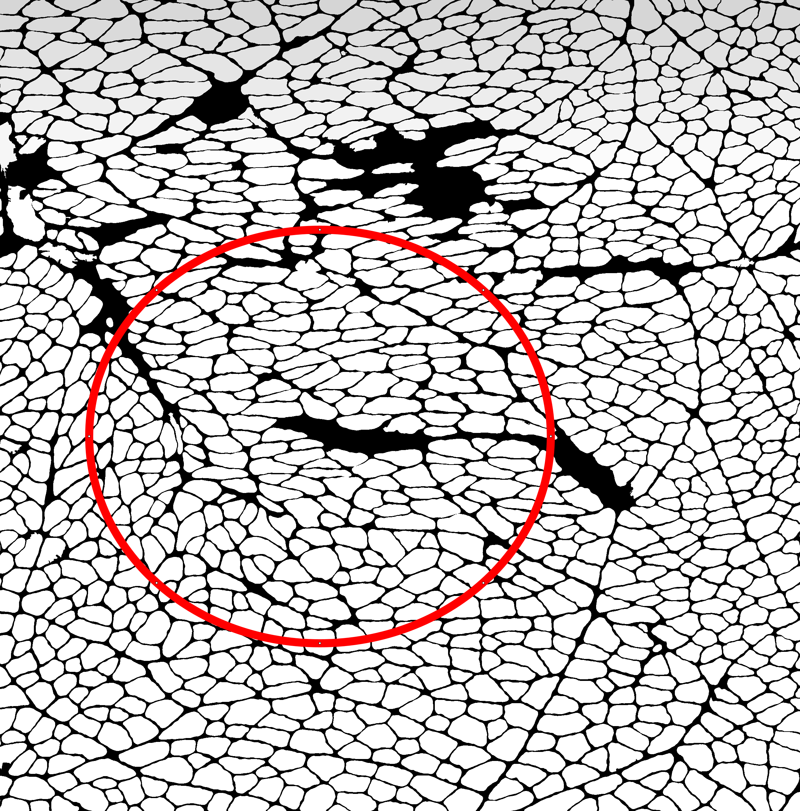
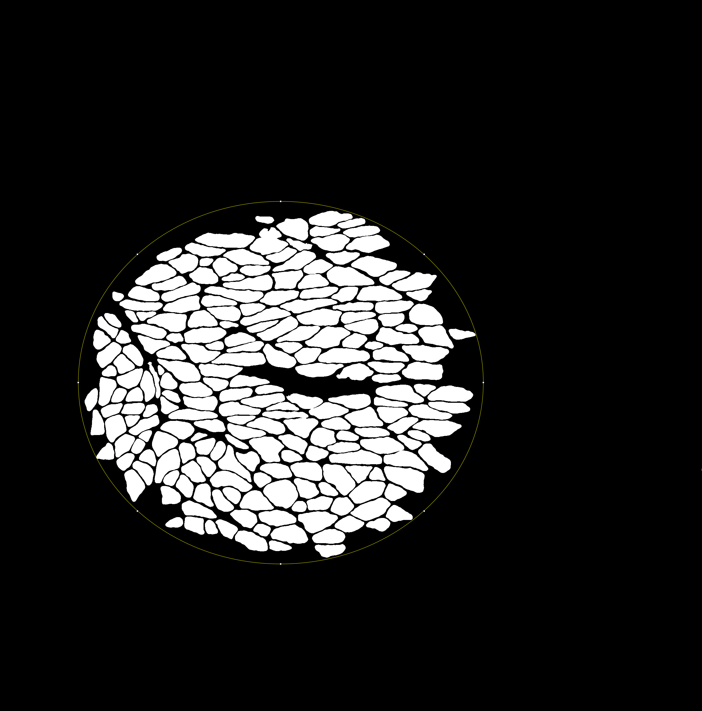
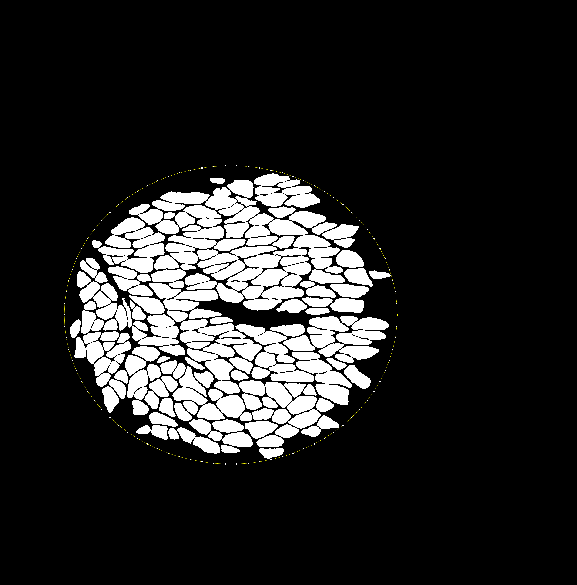

## Border Exclusion

Have you ever tried to remove labels or ROIs from a dedicated region, but struggled to exclude the objects you were interested in?

Then this plugin is for you!
* ✅ Works on 2D label images
* ✅ Works on 2D binary masks
* ✅ Works on 2D ROIs
* ✅ Fast on large images when interpolated
* ❎ 3D labels/ROIs

Parameters:
* Keep Overlaps: If true, this will keep any labels/rois overlapping with the boundary. Otherwise, all overlaps are excluded.
* Interpolation: For oval/freehand ROIs, interpolating the selection can speed up the functionality by converting your ROI into a polygon shape prior to border exclusion.

### Using Border Exclusion on Label Images

https://github.com/user-attachments/assets/5b8fc173-e1d9-4ab4-9a23-09a96e390f9f

## Interpolation acceleration

By increasing the interpolation interval, an OvalRoi or Freehand ROI is no longer subpixel-accurate, but the speed increase is substantial for resolving label images. 

The test below was used on a binary image of 2480 by 2512 pixels, using an oval ROI of size (w 1431,h 1281).

Original Image             |  Speed Increase via Interpolation
:-------------------------:|:-------------------------:
  |  

With results:

Post Removal (no interpolation) |  Post Removal (interpolation) 
:-------------------------:|:-------------------------:
  | 

## Scripting with Border Exclusion
A few examples of how to remove ROIs from the Fiji/ImageJ script editor:

```python
#@ LogService ls
from net.ianfc import BorderExclusion
from ij import IJ, Prefs
from ij.gui import OvalRoi

test_code = True
if test_code:
	IJ.run("Close All")
	imp = IJ.openImage("http://imagej.net/images/blobs.gif");
	imp.setAutoThreshold("Default no-reset");
	Prefs.blackBackground = True;
	IJ.run(imp, "Convert to Mask", "");
	roi = OvalRoi(50,47,100,156)
	BorderExclusion.remove_external(imp, roi, ls, True, 2)
	imp.show()
else:
	imp = IJ.getImage()
	roi = imp.getRoi()
	if not roi:
		IJ.log("Set an ROI first!")
	else:
		BorderExclusion.remove_external(imp, roi, ls, False, 0) # keep_overlaps: False, interpolation: 0
```

## Installation
For now, simply place the `border-exclusion-0.2.0-SNAPSHOT.jar` file into your `Fiji.app/jars` directory.

## Contributions
Any contributions are very welcome! Please file any issues or send a pull-request if you have suggestions.

I hope you enjoy this plugin!
