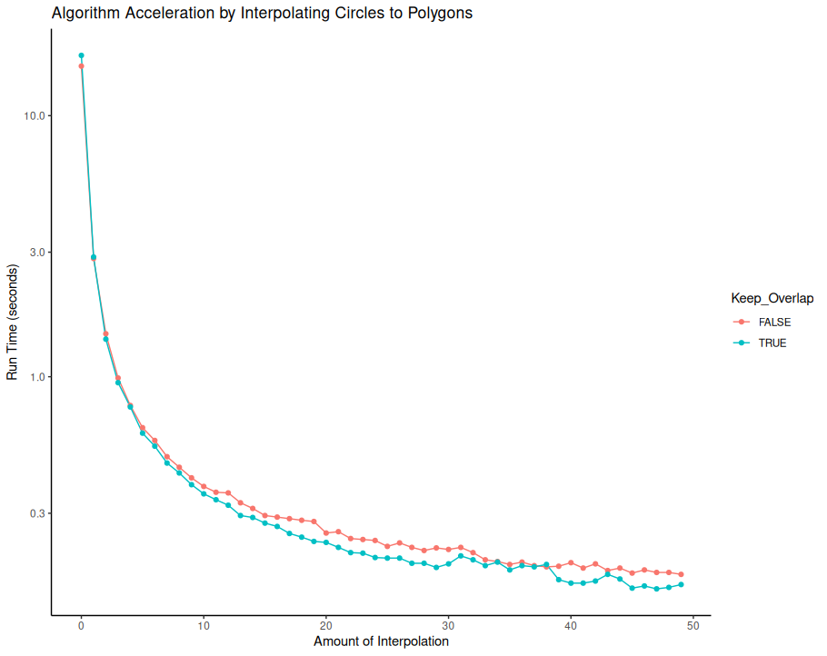

## Border Exclusion

Have you ever tried to remove labels or ROIs from a dedicated region, but struggled to specify exactly which region?

Then this plugin is for you!
* Works on label images
* Works on binary masks
* Fast on large images if interpolation

Parameters:
Keep Overlaps: If true, this will keep any overlaps w
Interpolation: For oval/freehand ROIs, interpolating can speed up the functionality by an order of magnitude

### Using Border Exclusion

## Installation
For now, simply place the border-exclusion-0.2.0-SNAPSHOT.jar file into your Fiji.app/jars directory.

In a future update, there will be a 
